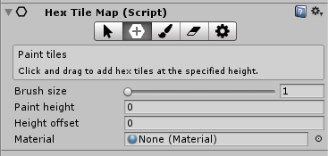
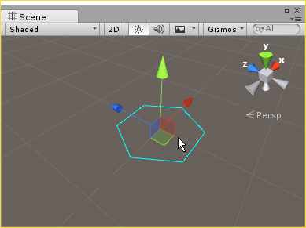
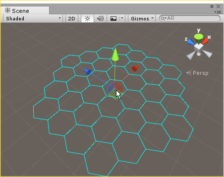
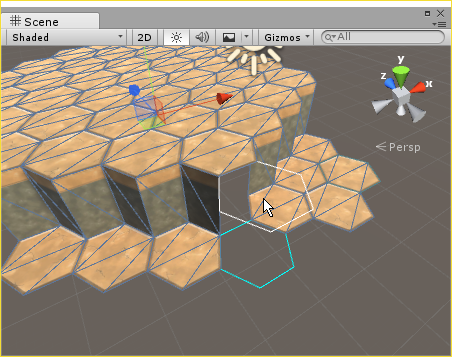
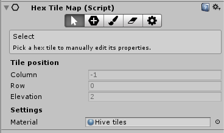
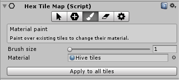
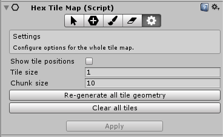

# Unity hex tile editor

A hex-based tile editor for Unity. Built for [Bees Won't Exist](http://honeyvalegames.com/bees-wont-exist/)

Check out my [YouTube playlist](https://www.youtube.com/playlist?list=PLvydZeK3xG9hFWaunAdrvl7W_ExOquTcA) for some examples of it in action.

<!-- START doctoc generated TOC please keep comment here to allow auto update -->
<!-- DON'T EDIT THIS SECTION, INSTEAD RE-RUN doctoc TO UPDATE -->
<!-- END doctoc -->

- [Getting started](#getting-started)
  - [Importing into your own project](#importing-into-your-own-project)
- [Basic use](#basic-use)
  - [Creating a tile map](#creating-a-tile-map)
  - [Tile painting](#tile-painting)
  - [Selecting and inspecting existing tiles](#selecting-and-inspecting-existing-tiles)
  - [Painting materials on existing tiles](#painting-materials-on-existing-tiles)
  - [Erasing tiles](#erasing-tiles)
  - [Settings and other options](#settings-and-other-options)
- [Setting up materials for use with hex tile maps.](#setting-up-materials-for-use-with-hex-tile-maps)
- [Tips and best practices](#tips-and-best-practices)

<!-- END doctoc generated TOC please keep comment here to allow auto update -->

# Getting started
## Importing into your own project
To get started, simply copy the whole `Assets/Code/HexTiles` folder as well as `Assets/Plugins/Fluent-State-Machine.dll` into your Unity project. This has been tested on Unity 5.4 but should work on earlier versions of 5.x as well. Note that Fluent-State-Machine is only required by the editor so if you want you can set it to be editor-only and not be included in your builds.

# Basic use
## Creating a tile map
Add the "Hex tile map" prefab to your scene, select it and you will see the inspector for the tile editor which should look something like this:

The tile map editor works in a similar way to Unity's terrain editor - you have several different tools for interacting with the map, and these are accessible from the toolbar at the top of the editor. Click the plus icon to go into tile painting mode and create some tiles.

## Tile painting

This is the main tool you will use to create tile maps. Moving the cursor over the scene view will show a blue outline where tiles will appear, and you can click and drag to place tiles. 

Adjusting the brush size allows you to paint over a wider area. 

Adjusting the offset height allows you to click and have tiles appear at an offset to the mouse position. This can be useful when you want to create ledges between tiles at multiple levels. In offset painting mode, the _paint height_ you selects represents the position in the hex map that should be selected by the mouse cursor and is highlighted in _white_. The position where a new tile will actually appear when you click is stil highlighted _blue_, but will be offset by the _height offset_ value from the main paint height. 

In all these cases, you only ever need to paint the tops of tiles. Side pieces will be generated automatically when two tiles at different heights are placed next to each other. 

## Selecting and inspecting existing tiles

Once you have some tiles in your tile map, you can use the _select_ mode to inspect their properties. This is accessible via the button that looks like a mouse cursor.

Click on tiles to inspect their properties. This is useful for checking the elevation of an existing tile before painting other tiles next to it, and you can individually change materials on tiles by selecting them and choosing a different material as well.

##  Painting materials on existing tiles
_Material paint_ mode can be used to easily and quickly paint different materials onto existing tiles without having to place new tiles over them. Click or drag on an existing tile in the scene view to change its material.

Clicking _Apply to all tiles_ will apply the currently selected material to all tiles in the tile map.

## Erasing tiles
_Erase_ mode can be used to delete existing tiles. This works in a similar way to _Material paint_ and _Paint tiles_ modes, as you click or drag the cursor on existing tiles to remove them. Like _Material paint_ and _Paint tiles_, _Erase_ also supports multiple brush sizes for quickly removing large areas of tiles. 

## Settings and other options
More options are available in the _Settings_ tab, accessible via the cog icon.

 - _Show tile positions_ draws text in the scene view above each tile with its position. This was originally intended as a debugging feature but can be useful when setting up more complex tile maps. Not recommended for large maps as it kills performance in the Unity Editor. 
 - _Tile size_ sets how wide each tile should be. It is recommended to change this rather than just scaling the transform of the object containing the whole map. 
 - _Chunk size_ sets how many tiles should be combined into each mesh for performance. This can be tweaked to work out the best value for your project. Note that this does not update until you click _Apply_.
 - _Re-generate all tile geometry_ deletes all tile meshes and re-generates them using saved information about their positions. This can be useful to undo changes that have been manually applied to the generated chunk objects, or reset the scene if something breaks due to an error.
 - _Clear all tiles_ deletes all tiles in the current tile map. This is a destructive operation and should be used with caution. 

# Setting up materials for use with hex tile maps.
See `Assets/Example Content/Textures` for some examples for how to set up a texture for use with a tile map. Tops of tiles and side pieces are stored on the same texture atlas so that a map can be drawn in a single batch, with the top pieces taking up the top half of the texture and the side pieces taking up the lower half. See the `Test tileset` image for reference:

The area for the top pieces contains 4x3 tiles, which are numbered in the test tileset. Note that these are slightly stretched vertically, which is necessary to make them fit into a square texture. 

The area for the side pieces is split into an upper and a lower half. The top half is only used once and the lower half is looped forever. This is useful for times when you might want the texture from the top to spill over onto the sides for a short while (for example, the grass texture in `OutDoorTileset.png`). Each hex has 6 sides and these are split up evenly across the texture.

# Tips and best practices
 - Selecting a tile map overrides the default Unity left-click behaviour so you won't be able to click on other objects to select them after selecting a hex tile map. This is intentional, and you can go back to selecting objects normally by clicking on something else in the scene hierarchy window.
 - In some cases you may want to modify the tiles that have been generated by this plugin. In those cases it is best to remove the HexTileMap script from the parent object so that no one later on accidentally paints more tiles and causes that chunk to be re-generated, removing any changes that may have been made since then.
 - It is often useful to have several different hex tile maps in the same scene for tiles that are meant to be independent.